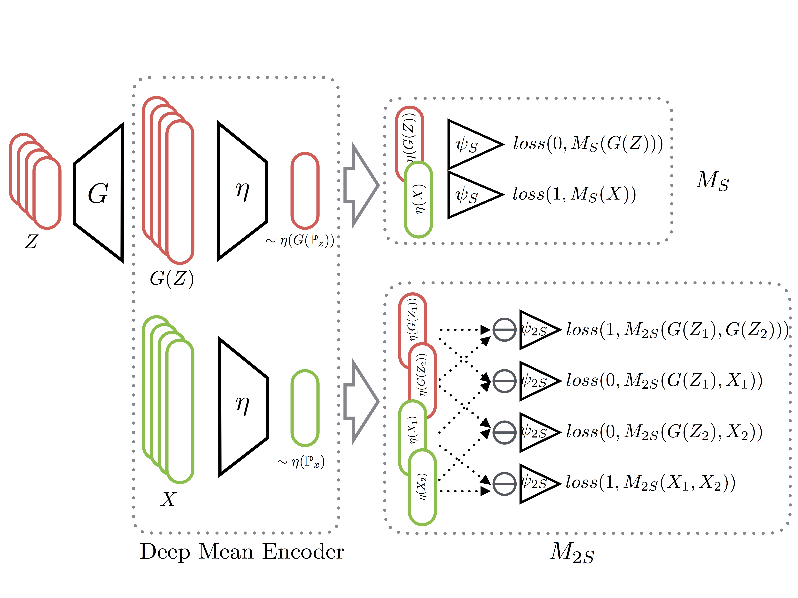
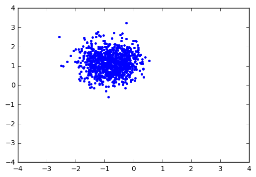
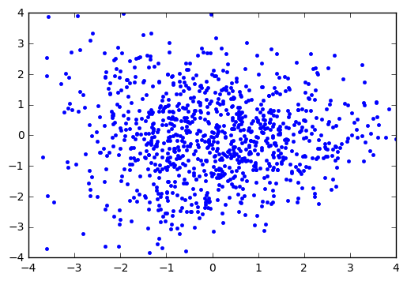
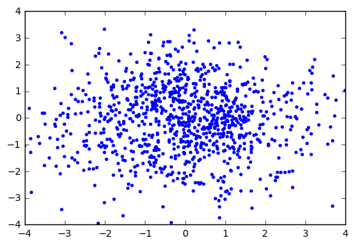
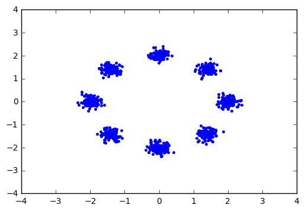

# DAN: Distributional Adversarial Networks

Tensorflow demo code for paper [Distributional Adversarial Networks](https://arxiv.org/abs/1706.09549) by [Chengtao Li\*](http://chengtaoli.com), [David Alvarez-Melis\*](http://people.csail.mit.edu/davidam/), [Keyulu Xu](http://keyulux.com), [Stefanie Jegelka](http://people.csail.mit.edu/stefje/) and [Suvrit Sra](http://suvrit.de).

## Summary

The main difference with the original GAN method is that the Discriminator is operates on samples (of n>1 examples) rather than a single sample point to discriminate between real and generated distributions. In the paper we propose two such type of methods:
* A single-sample classifier $M_S$ which classifies samples as fake or real (i.e. a sample-based analogue to the original GAN classifier)
* A two-sample discriminator $M_{2S}$ which must decide whether two samples are drawn from the same distribution or not (reminiscent of two-sample tests in the the statistics literature)

Both of these methods relies on a first stage encoder (Deep Mean Encoder), which embeds and aggregates individual examples to obtain a fixed-size representation of the sample. These vectors are then used as inputs to the two types of classifiers. 

A schematic representation of these two methods is:



## Prerequisites
* `Python 2.7`
* `tensorflow >= 1.0`
* `numpy`
* `scipy`
* `matplotlib`

---

## Toy Experiments

A self-contained implementation of the two DAN models applied to a simple 2D mixture of gaussians examples can be found in [this notebook](toy/toy_demo.ipynb) in `toy` folder. Some of the visualization tools were borrowed from [here](https://github.com/poolio/unrolled_gan/blob/master/Unrolled%20GAN%20demo.ipynb).

### Visualization
| Vanilla GAN                   | DAN-S                         |                      
|:-----------------------------:|:-----------------------------:|
|           |         |

| DAN-2S                        | Ground Truth                  |
|:-----------------------------:|:-----------------------------:|
|        |          |


## MNIST Digit Generation
This part of code can be used to reproduce experimental results on MNIST digit generation. It lies in `mnist` folder and is built based on [DCGAN Implementation](https://github.com/carpedm20/DCGAN-tensorflow).

### Training
To train the adversarial network, run
```
python main_mnist.py --model_mode [MODEL_MODE] --is_train True
```
Here `MODEL_MODE` can be one of `gan` (for vanilla GAN model), `dan_s` (for DAN-S) or `dan_2s` (for DAN-2S). 

### Evaluation
To evaluate how well the model recovers the mode frequencies, one need an accurate classifier on MNIST dataset as an approximate label indicator. The code for the classifier is in `mnist_classifier.py` and is adapted from [Tensorflow-Examples](https://github.com/aymericdamien/TensorFlow-Examples/). To train the classifier, run
```
python mnist_classifier.py
```
The classifier has an accuracy of \~97.6\% on test set after 10 epochs and is stored in the folder `mnist_cnn` for later evaluation. To use the classifier to estimate the label frequencies of generated figures, run
```
python main_mnist.py --model_mode [MODEL_MODE] --is_train False
```
The result will be saved to the file specified by `savepath`. A random run gives the following results with different `model_mode`'s.

|              | Vanilla GAN  | DAN-S        | DAN-2S       |
|:------------:|:------------:|:------------:|:------------:|
| Entropy (the higher the better)      | 1.623        | 2.295        | 2.288        | 
| TV Dist (the lower the better)      | 0.461        | 0.047        | 0.061        | 
| L2 Dist (the lower the better)      | 0.183        | 0.001        | 0.003        | 

### Visualization
The following visualization shows how the randomly generated figures evolve through 100 epochs with different models. While for vanilla GAN the figures mostly concentrate on ''easy-to-generate'' modes like `1`, models within DAN framework generate figures that have better coverages over different modes.

|Vanilla GAN                    |  DAN-S                        |  DAN-2S                       |
|:-----------------------------:|:-----------------------------:|:-----------------------------:|
| |     |   |

## Domain Adaptation
This part of code can be used to reproduce experimental results of domain adaptation from MNIST to MNIST-M. It lies in `dann` folder and is built based on [DANN Implementation](https://github.com/pumpikano/tf-dann).

### Build Dataset 
Run the following commands to download and create MNIST-M dataset.
```
curl -O http://www.eecs.berkeley.edu/Research/Projects/CS/vision/grouping/BSR/BSR_bsds500.tgz
python create_mnistm.py
```
(instructions from [here](https://github.com/pumpikano/tf-dann))

### Training
To train the adversarial network, run
```
python mnist_dann.py --model_mode [MODEL_MODE]
```
Here `MODEL_MODE` can be one of `gan` (for vanilla GAN model), `dan_s` (for DAN-S) or `dan_2s` (for DAN-2S). A random run gives the following prediction accuracy on MNIST-M when the classifier is trained on MNIST.

|              | Vanilla GAN  | DAN-S        | DAN-2S       |
|:------------:|:------------:|:------------:|:------------:|
| Accuracy     | 77.0%        | 78.8%        | 80.4%        | 

## Citation
If you use this code for your research, please cite our [paper](https://arxiv.org/abs/1706.09549):

```
@article{li2017distributional,
  title={Distributional Adversarial Networks},
  author={Chengtao Li, David Alvarez-Melis, Keyulu Xu, Stefanie Jegelka, Suvrit Sra},
  journal={arXiv preprint arXiv:1706.09549},
  year={2017}
}
```

## Contact
Please email to [ctli@mit.edu](mailto:ctli@mit.edu) should you have any questions, comments or suggestions.
